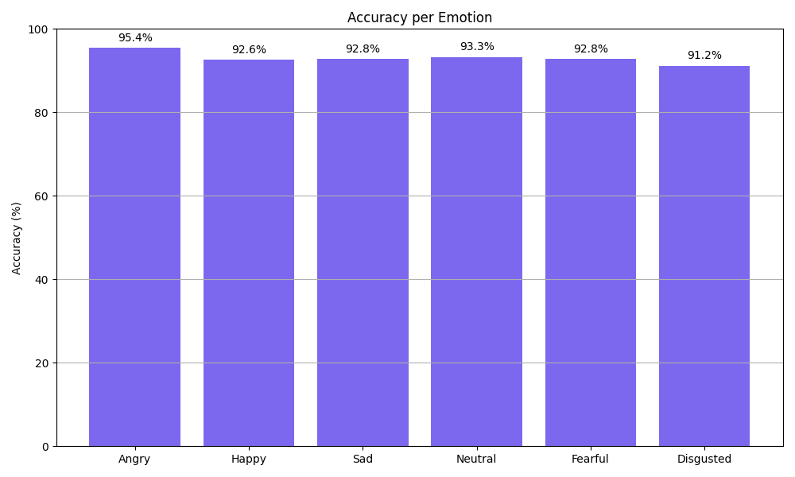
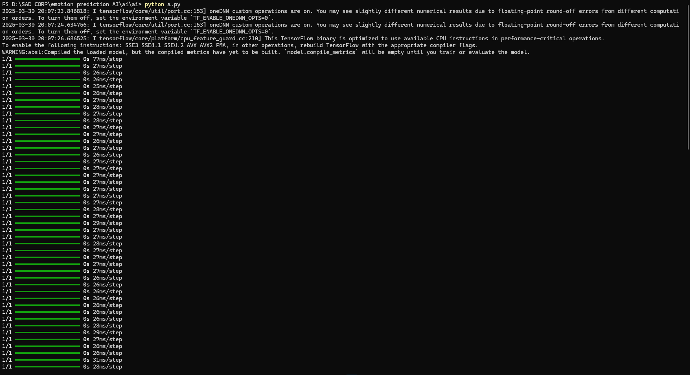
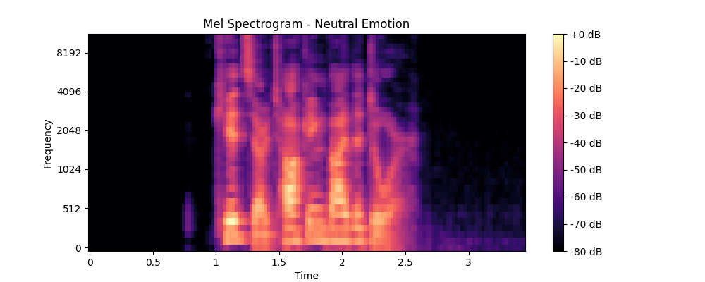
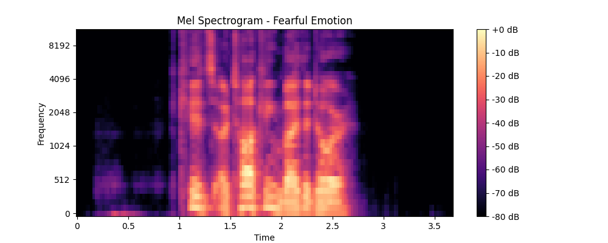
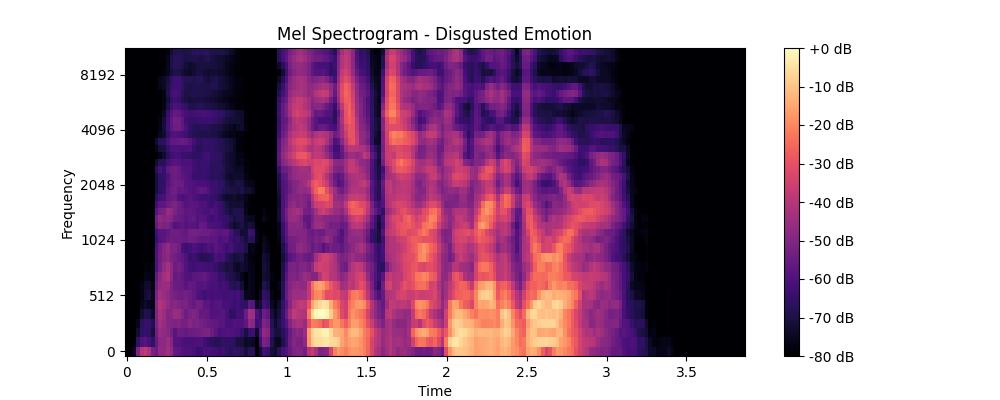
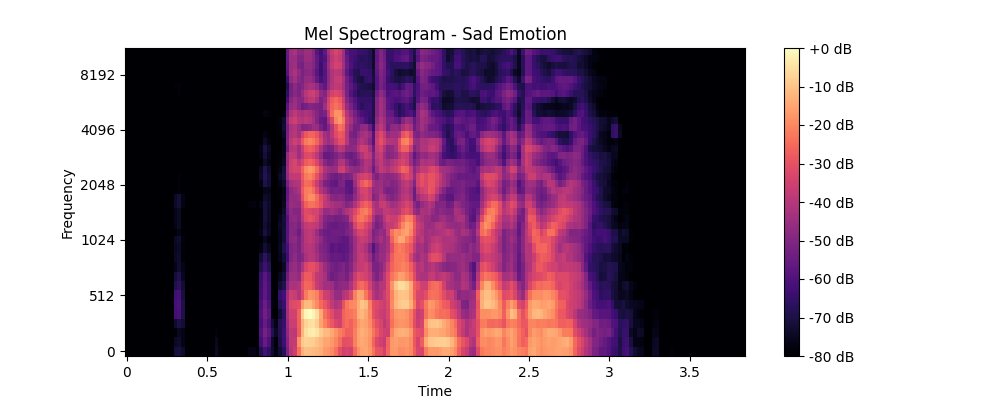

🎵 Audio Emotion Recognition Using Machine Learning

📌 Project Overview

Audio Emotion Recognition (AER) is the process of identifying human emotions from speech signals.
This project focuses on building a Machine Learning–based system that automatically classifies emotions from audio input using MFCC feature extraction and a Convolutional Neural Network (CNN).
The system analyzes speech signals and predicts emotions such as Happy, Sad, Angry, Fearful, Neutral, and Disgusted.
This project was developed as a UG Major Project (BCA) and emphasizes both technical implementation and practical ML workflow.

🎯 Objectives

To analyze human emotions from speech audio
To extract meaningful audio features using MFCC
To design and train a CNN model for emotion classification
To evaluate model performance using visual outputs
To gain hands-on experience with real-world ML pipelines

🧠 Emotions Classified

The system classifies the following emotions:
Angry
Disgusted
Fearful
Happy
Neutral
Sad

🏗️ System Architecture

Audio Input
Preprocessing
Noise handling
Sampling rate normalization
Feature Extraction
MFCC (Mel-Frequency Cepstral Coefficients)
Model Training
Convolutional Neural Network (CNN)
Prediction & Evaluation
Emotion classification
Visualization of results

🛠️ Technologies Used

Programming & Libraries
Python
TensorFlow / Keras
Librosa
NumPy
Scikit-learn
Matplotlib
Tools
Git & GitHub
macOS Terminal
Jupyter Notebook (during experimentation)

📂 Project Structure

audio-emotion-recognition-ml/
│
├── results/
│   ├── emotions/
│   │   ├── Angry/
│   │   ├── Disgusted/
│   │   ├── Fearful/
│   │   ├── Happy/
│   │   ├── Neutral/
│   │   └── Sad/
│   │
│   └── plots/
│       ├── bar_graph.png
│       ├── Disgusted.png
│       ├── Fearful.png
│       ├── Neutral.png
│       ├── result.png
│       └── sad.png
│
├── src/                # Model and preprocessing scripts (future extension)
├── models/             # Trained model (ignored in GitHub)
├── requirements.txt
├── README.md
└── .gitignore

📊 Results & Visualizations

The project includes visual proof of model performance, such as:
Emotion-wise spectrogram outputs
Bar graph showing emotion probabilities
Final predicted emotion display
These visualizations help understand how the model interprets audio data and makes predictions.

📁 Datasets Used

The model was trained and evaluated using publicly available datasets:
RAVDESS – Ryerson Audio-Visual Database of Emotional Speech and Song
TESS – Toronto Emotional Speech Set
CREMA-D – Crowd-sourced Emotional Multimodal Actors Dataset

⚠️ Datasets are not included in this repository due to size limitations.

👩‍💻 Role & Contribution

Role: Team Lead – UG Major Project

Responsibilities:
Designed the complete ML pipeline
Implemented MFCC-based feature extraction
Built and trained the CNN model
Analyzed and visualized model outputs
Coordinated team tasks and documentation
Prepared final project report and presentation

🚀 How to Run the Project (Basic Setup)

Clone the repository:
git clone https://github.com/Pavi1906/audio-emotion-recognition-ml.git
cd audio-emotion-recognition-ml

Install dependencies:
pip install -r requirements.txt
(Optional) Train or load the model locally
(Model file is excluded from GitHub as per best practices)

🔮 Future Enhancements

Real-time emotion recognition
Noise-robust feature extraction
Web or desktop-based interface
Support for multilingual speech
Deployment using Flask or Streamlit

📄 Academic Context

This project was developed as part of the Bachelor of Computer Applications (BCA) curriculum
and completed between 2022–2025.

📬 Contact

If you have suggestions or would like to collaborate, feel free to connect with me on LinkedIn.

### 🔍 Sample Model Outputs

#### Emotion Probability Distribution

#### Predicted Emotion Result

#### Emotion-wise Spectrogram Samples

**Neutral Emotion**

**Fearful Emotion**

**Disgusted Emotion**

**Sad Emotion**

